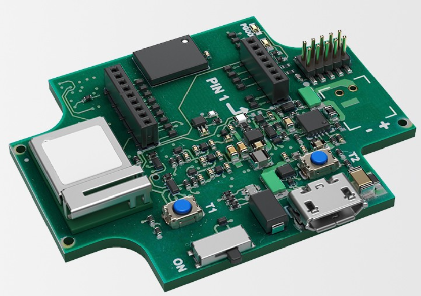

.. _bst_ab3_nrf52840:

Bosch Sensortec Application Board 3.0 
######################################

Overview
********
The application board 3.0 is a versatile and sensor independent development platform, 
enabling a fast and easy experience with Bosch Sensortec’s sensors. 
As shuttle boards 3.0, a wide variety of Bosch Sensortec’s sensors can be plugged 
into the application board’s shuttle board socket. The combination of the 
application board 3.0 and shuttle board 3.0 can be used to evaluate the sensors 
and build prototypes to test use cases. The application board is a closed system 
that can be used to configure sensor parameters and to plot and log the resulting 
sensor readings by means of PC based software (Desktop Development) and COINES.

The application board 3.0 uses the uBlox NINA-B302 Bluetooth Low Energy module
based on the Nordic Semiconductor nRF52840 ARM Cortex-M4F CPU and the following devices:

* :abbr:`ADC (Analog to Digital Converter)`
* CLOCK
* FLASH
* :abbr:`GPIO (General Purpose Input Output)`
* :abbr:`I2C (Inter-Integrated Circuit)`
* :abbr:`MPU (Memory Protection Unit)`
* :abbr:`NVIC (Nested Vectored Interrupt Controller)`
* :abbr:`PWM (Pulse Width Modulation)`
* RADIO (Bluetooth Low Energy and 802.15.4)
* :abbr:`RTC (nRF RTC System Clock)`
* Segger RTT (RTT Console)
* :abbr:`SPI (Serial Peripheral Interface)`
* :abbr:`UART (Universal asynchronous receiver-transmitter)`
* :abbr:`USB (Universal Serial Bus)`
* :abbr:`WDT (Watchdog Timer)`

     BST-AB3 (Credit: Bosch Sensortec GmBH)

More information about the Application Board 3.0
can be found at the `Robert Bosch Sensortec website`_.

Release Note
************
The current release is a limited release which only supports the blinky and hello world
Zephyr sample applications, without any support for specific shuttle boards. A more 
useful release will be available soon

Hardware
********

The NINA-B30x  contains an internal high-frequency
oscillator at 32MHz as well as a low frequency (slow) oscillator
of 32.768kHz.

Supported Features
==================

+-----------+------------+----------------------+
| Interface | Controller | Driver/Component     |
+===========+============+======================+
| ADC       | on-chip    | adc                  |
+-----------+------------+----------------------+
| CLOCK     | on-chip    | clock_control        |
+-----------+------------+----------------------+
| FLASH     | on-chip    | flash                |
+-----------+------------+----------------------+
| GPIO      | on-chip    | gpio                 |
+-----------+------------+----------------------+
| I2C(M)    | on-chip    | i2c                  |
+-----------+------------+----------------------+
| MPU       | on-chip    | arch/arm             |
+-----------+------------+----------------------+
| NVIC      | on-chip    | arch/arm             |
+-----------+------------+----------------------+
| PWM       | on-chip    | pwm                  |
+-----------+------------+----------------------+
| RADIO     | on-chip    | Bluetooth,           |
|           |            | IEEE 802.15.4        |
+-----------+------------+----------------------+
| RTC       | on-chip    | system clock         |
+-----------+------------+----------------------+
| RTT       | Segger     | console              |
+-----------+------------+----------------------+
| SPI(M/S)  | on-chip    | spi                  |
+-----------+------------+----------------------+
| UART      | on-chip    | serial               |
+-----------+------------+----------------------+
| USB       | on-chip    | usb                  |
+-----------+------------+----------------------+
| WDT       | on-chip    | watchdog             |
+-----------+------------+----------------------+

Other hardware features, specifically the Bosch Sensortec add-on shuttle boards, are not 
currenty supported by the Zephyr kernel.
See the `Bosch Sensortec Website`_ for further details of available shuttle boards
and their hardware features.

Connections and IOs
===================

LED
---

* LED0 (red) = P0.7
* LED1 (green) = P0.12
* LED2 (blue) = P0.11

Push buttons
------------

* BUTTON1 = T1 = P0.9
* BUTTON2 = T2 = P0.25

External Connectors
-------------------

.. note::
	The pin numbers noted below refer to the shuttle board pins of
	Application Board 3.0. Further details can be found in the 
	document Application Board 3.0 User Guide, which can be 
	downloaded from the `Bosch Sensortec Website`_
.. note::
    The pin numbers in the description column refer to pin numbers
    of the NRF52840 to which the shuttle board pins are connected. 
.. note::
    The signal names are the most common usage, but can vary from 
    shuttle board to shuttle board. Please refer the documentation of 
    the shuttle board you are using
.. note::
    Vdd powers the shuttle board. It can be 2.8 V or 1.8 V, depending 
    on the state of Vdd-En (P0.03). Default is 1.8V. 2.8V can be activated
    for a given application at boot time by activating the corresponding 
	configuration flag in the application prj.conf by adding this line
	CONFIG_BST_AB3_NRF52840_SELECT_VDD_2_8=y
    This flag is handled in the kernel boot hook in the board.c file
   
  Shuttle Board Pins Row1
  ***********************
+-------+--------------+-------------------------+
| PIN # | Signal Name  | Description
+=======+==============+=========================+
| 1     | Vdd          | Sensor Power 2.8/1.8V   |
+-------+--------------+-------------------------+
| 2     | VddIO        | Ref IO Voltage          |
+-------+--------------+-------------------------+
| 3     | GND          | Ground                  |
+-------+--------------+-------------------------+
| 4     | GPIO0        | P0.14                   |
+-------+--------------+-------------------------+
| 5     | GPIO1        | P0.13                   |
+-------+--------------+-------------------------+
| 6     | GPIO2/INT1   | P1.01                   |
+-------+--------------+-------------------------+
| 7     | GPIO3/INT2   | P1.08                   |
+-------+--------------+-------------------------+

  Shuttle Board Pins Row2
  ***********************
+-------+--------------+-------------------------+
| 1     | CS           | P0.24                   |
+-------+--------------+-------------------------+
| 2     | SCK/SCL      | P0.16                   |
+-------+--------------+-------------------------+
| 3     | SDO          | P0.15                   |
+-------+--------------+-------------------------+
| 4     | SDI/SDA      | P0.06                   |
+-------+--------------+-------------------------+
| 5     | GPIO4/OCSB   | P1.03                   |
+-------+--------------+-------------------------+
| 6     | GPIO5/ASCx   | P1.02                   |
+-------+--------------+-------------------------+
| 7     | GPIO6/OSDO   | P1.11                   |
+-------+--------------+-------------------------+
| 8     | GPIO7/ASDx   | P1.10                   |
+-------+--------------+-------------------------+
| 9     | PROM-RW      | P0.05                   |
+-------+--------------+-------------------------+

Programming and Debugging
*************************

Applications for the ``bst_ab3_nrf52840`` board configuration are expected
to be built and debugged using ``Visual Studio Code`` with the ``nRF Connect``
plugin.

The nRF Connect plugin can be intalled using ``nRF Connect for Desktop`` which
can be downlaoded from the ``Nordic Semiconductor`` website. This is the only tool
chain which has been tested as of date with this board. Further information
and tutorials for nRF Connect are available on the Nordic Semiconductor website.

When creating an application in this environment, select ``bst_ab3_nrf52840``
as the custom board for creating applications for this board. For debugging, the
Segger J-Link Debug probes can be connected to the SWD Debugger interface 
on the board.

Flashing
========

Flashing takes place via the debugger and nrfjprog tool which is invoked
by the nRF Connect plugin. This is default in the Visual Studio Code with nRF Connect
plugin environment, which is recommended for this release.

Flashing via the USB port by leveraging on the DFU MTP Firmware which is pre-flashed on the 
board is also possible, using the ``COINES SDK`` which is available on the Bosch Sensortec
website. This can be done like this:

1. Install the COINES SDK from the :ref:`Bosch Sensortec COINES SDK website`
2. Build your zephyr application using the previously described procedure.
3. Press the T2 button on the board and switch the board off and on using the power switch.
   The Blue LED shoud go on, indicating it is in the bootloader mode  
4. CD to your zephyr application directory (which should contain a build subdirectory 
   with the zephyr bin) If your build directory is elsewhere modify the paths in the
   following commands
5. Run the following commands:
C:\COINES\V2.6.0\tools\app_switch\app_switch usb_dfu_bl
C:\COINES\V2.6.0\tools\usb-dfu\dfu-util --device -,108c:ab3d -a FLASH -D .\build\zephyr\zephyr.bin -R

Note that if your COINES installation or build is in some other directory, the above paths
need to be modified.

Note also that if you do a debug run in VS Code, it may reflash the application from address
0x000000, overwriting the pre-flashed USB MTP firmware, in which case above procedure will
no longer be possible. It may then be necessary to restore the board to its factory condition
using a procedure given in the COINES User Guide.

Note that if the path to dfu-util.exe is added to the Windows PATH environment variable, 
'west flash' can also be used from the Zephyr directory instead of invoking it directly as in
point 5 above.

Console
=======

Console output can be currently viewed on the Segger J-Link RTT Viewer if the
Segger J-Link debugger probes are connected.

Console output via ACM USB UART emmulation will be available in future releases.

Testing the LEDs and buttons in BST-AB3-NRF52840
*************************************************

There are 2 samples that allow you to test that the buttons
(switches) and LEDs on the board are working properly with Zephyr:

.. code-block:: console

   samples/basic/blinky
   samples/basic/button

You can build and flash the examples to make sure Zephyr is running correctly on
your board. The button and LED definitions can be found in
:zephyr_file:`boards/arm/bst_ab3_nrf52840/bst_ab3_nrf52840.dts`.

References
**********

.. target-notes::

.. Bosch Sensortec AB3 website: https://www.bosch-sensortec.com/software-tools/tools/application-board-3-0/
.. Bosch Sensortec COINES SDK website: https://www.bosch-sensortec.com/software-tools/tools/coines/

.. NRF Connect SDK Website: https://developer.nordicsemi.com/nRF_Connect_SDK/doc/latest/nrf/gs_assistant.html#gs-assistant
